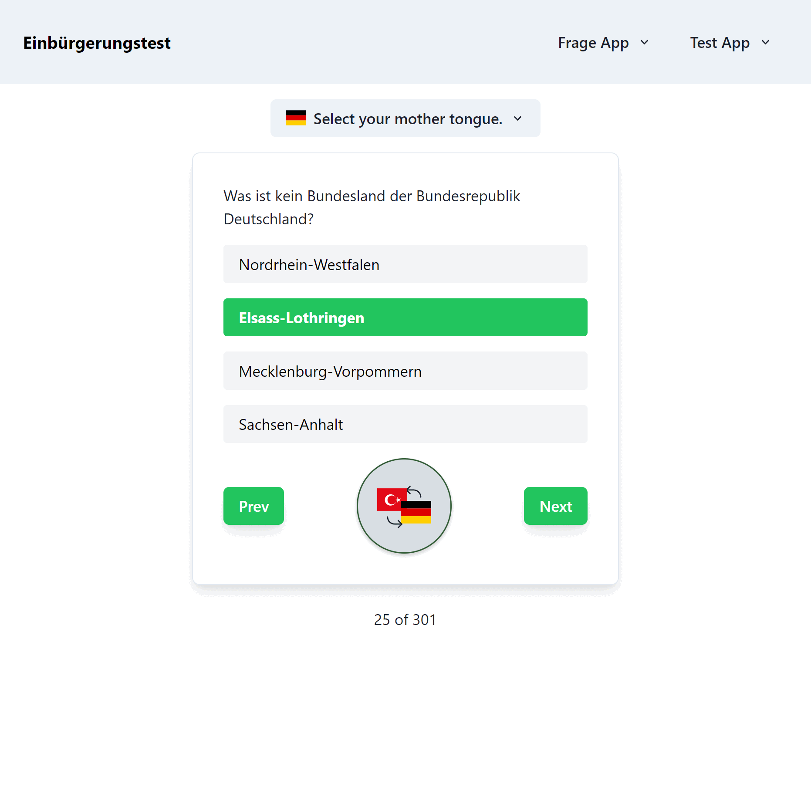

# Einbürgerungstest Online

Einbürgerungstest Online is a comprehensive tool designed to help individuals prepare for the German Naturalization Test. It features all 300 official questions, which users can practice with and instantly translate into more than seven languages for ease of understanding.

## Screenshots

<p align="center">
  
</p>


## Live Demo

To see Einbürgerungstest Online in action, visit our website: [https://www.einbuergerungstestonline.com/](https://www.einbuergerungstestonline.com/)

## Installation

To set up Einbürgerungstest Online locally, follow these steps:

1. Clone the repo:
```
git clone <repository-url>
```
2. Install the necessary dependencies:

```
npm install
```
3. Start the development server:
```
npm run dev
```


**Note:** You'll need a Google Translate API key to utilize the translation features. Visit [Google Cloud Translate](https://cloud.google.com/translate?hl=en) for more information on obtaining an API key.

## Built With

- [Next.js:](https://nextjs.org/) A React framework for building user interfaces and developing single-page applications.
- [MongoDB](https://www.mongodb.com/) NoSQL database for modeling and managing application data.
- [Prisma:](https://www.prisma.io/) Next-generation ORM for Node.js and TypeScript, enhancing database workflows.
- [Chakra UI:](https://chakra-ui.com/) A simple, modular, and accessible component library that gives you the building blocks to build your React applications.
- Love, lots of love ♥

For more information on these technologies, please visit their websites.

## Contributing

Improvements to Einbürgerungstest Online are welcome! Here's how you can contribute:

1. Fork the repository.
2. Make your changes.
3. Push to your fork.
4. Submit a pull request.

We appreciate your contributions:)

## Author

**Gabriel Mata**

- [GitHub](https://github.com/freeflyaz)
- [LinkedIn](https://www.linkedin.com/in/freeflyaz/)

## License

This project is licensed under the MIT License - see the LICENSE file for details.


